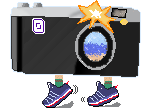

# Didiff 📸, the Scaleway pages diffing tool

## Of what is the project composed?

There are two parts:

- The `lib` which contains the process of taking website captures, diff it and then upload it to s3. This is this repo. You're in the `lib` actually!
- The `UI` which contains the web UI to view the diff files. You can found the code of the `UI` [here](https://***REMOVED***/front/scaleway-global-differ).

### To use

- Add the package on your project with `yarn add @scaleway/didiff-lib`
- You must have the `vips` library installed on your system. Please see the [install process](https://libvips.github.io/libvips/install.html).
- Use it with `yarn run didiff capture file`
- `file` is a mandatory argument which is a path to a file with a list of url in it. See the section `File format` for more information.
- You can follow track of the process by watching logs on your terminal.
- You can also wait on the `UI` and start to examine the diff, if any!
- Please note that the lib uses s3 for the storage of files. You need to add to your `env` the correct value. See more on `Config env`.

## The functioning ?

Actually, the script process is:

- Get the urls from the `file` argument and parse them
- Then, a loop starts
  * captures urls page by peer
  * generate PNGs based on the captures
  * diff those PNGs
  * if there is a diff, generate the diff PNG
  * upload to s3 the 3 PNGs to human-comparison purpose
  * clean the generated PNGs from file-system

## File format

The `file` passed to the script must be a simple text file with a list of urls, separeted by a new line `("\n")`
We need two urls to make a diff so each line must be two urls, separated by a comma `(",")`

e.g.

```
https://www.scaleway.com/en/saas/,https://global-website.stg.frt.internal.scaleway.com/en/saas/
https://www.scaleway.com/en/betas/,https://global-website.stg.frt.internal.scaleway.com/en/betas/
https://www.scaleway.com/en/startup-program/,https://global-website.stg.frt.internal.scaleway.com/en/startup-program/
```

In the output, the first url of the line will be called the `original` and the second the `sample`

## Config env

Since `Didiff` uses s3, you must log in to it. You have to add your credentials in your env (or `.env`). The keys are:

#### Mandatory

- `REACT_APP_DIDIFF_S3_ENDPOINT` e.g. "s3.fr-par.scw.cloud"
- `REACT_APP_DIDIFF_S3_SECRET_KEY`
- `REACT_APP_DIDIFF_S3_ACCESS_KEY`
- `REACT_APP_DIDIFF_S3_BUCKET_NAME`

#### Optional

- `REACT_APP_DIDIFF_HIDE_ELEMENTS`: CSS selectors which will be hided in your page, separated by a comma e.g. "iframe,section" will apply a `visibility: hidden` on all `iframe` and `section` of the page
- `REACT_APP_DIDIFF_VIEWPORT_WIDTH`: width of the viewport used for the screenshot. By default, will be `990`

## Contact

Please contact @teamfrontweb on Slack for any inquiries


